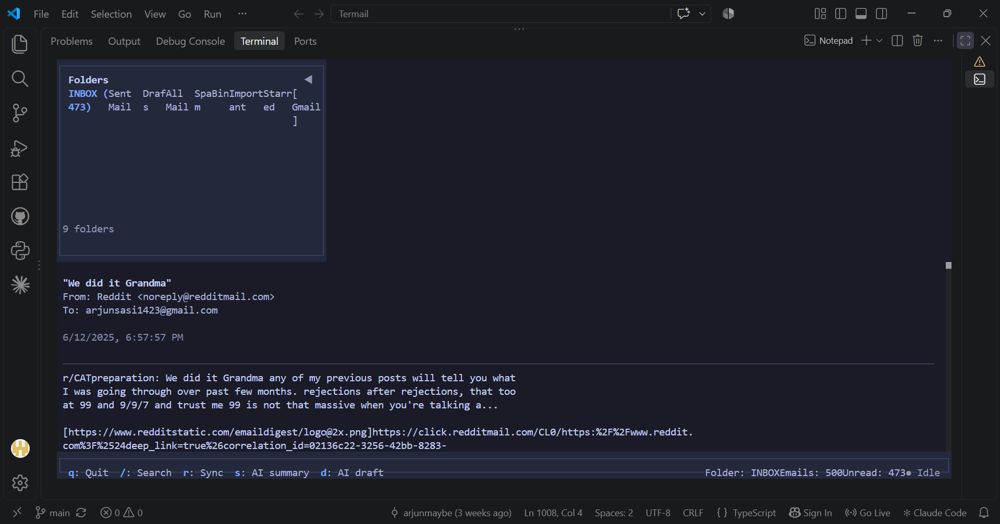

# Termail

A terminal email client built with Bun, TypeScript, and OpenTUI.

Termail syncs mail over IMAP, stores messages locally in SQLite, sends mail
over SMTP, and provides keyboard-first navigation and FTS5 search.

## Features

- IMAP sync (imapflow) with local SQLite persistence and per-folder checkpoints
- Fresh-account bootstrap: folder discovery, INBOX preferred, then message sync
- Full-text search (FTS5) with structured operators (`from:`, `subject:`, `is:`, dates)
- SMTP sending over implicit TLS / STARTTLS (password auth, no external SMTP library)
- Keyboard-first TUI (`j/k` mail, `h/l` folders, `/` search, `r` sync, `q` quit)
- Optional AI summarization and reply drafting via OpenRouter (off by default, never auto-sends)
- JSON config with Zod validation; strict TypeScript; Biome lint/format

## Limitations

- Compose is service-level (`ComposeController` + `SmtpService`): sending works
  programmatically and via AI-drafted replies routed into compose for review.
  There is no full-screen compose editor; external-editor composition is planned.
- `bun run build` currently fails to bundle `@opentui/core` platform packages
  in this environment (pre-existing packaging issue, unrelated to app code).
  `bun run dev`, `bun run test:sequential`, and `bun run typecheck` are the
  canonical checks.

## Quick Start

### Prerequisites

- [Bun](https://bun.sh/) v1.1+

### Install

```bash
# Clone and install
git clone <repo-url>
cd termail
bun install

# Development
bun run dev

# Build — currently blocked (see Limitations; command kept for reference)
# bun run build

# Run tests (deterministic Bun gate: sequential workers avoid
# pre-existing TUI renderer / global-state contention)
bun run test:sequential

# Vitest runner for the Node-compatible subset only
# (uses vitest.config.ts + src/test/setup.ts).
# The DB-backed suite requires Bun's `bun:sqlite`, so Vitest under
# Node cannot load it; it does not execute the complete suite.
# Bun remains the canonical runner.
bun run test:vitest

# Type check
bun run typecheck

# Lint
bun run lint

# Format
bun run format
```

## Project Structure

```text
termail/
├── src/
│   ├── main.ts                 # Entry point
│   ├── app/
│   │   ├── App.ts              # Root renderable
│   │   ├── layout/             # Layout components (Sidebar, ContentPane, StatusBar)
│   │   ├── components/         # UI components (EmailListView, FolderTabs, WelcomeView)
│   │   └── theme.ts            # Color themes
│   ├── core/
│   │   ├── config/             # Configuration system (ConfigStore, defaults, Zod schema)
│   │   ├── database/           # SQLite database layer (Database, migrations, schema)
│   │   ├── state/              # Reactive app state
│   │   ├── types/              # Core TypeScript types
│   │   ├── imap/               # IMAP sync (service, folders, messages, credentials)
│   │   ├── smtp/               # SMTP sending (service, transport, message, config)
│   │   ├── search/             # Search query parser
│   │   ├── ai/                 # AI assistance (service, prompts, transport)
│   │   └── utils/              # Utilities (logger, errors)
│   ├── app/services/           # SyncService, SearchService/Controller, Compose/AiController
│   └── test/                   # Test setup (Bun sqlite, OpenTUI harness)
├── tests/                      # Test files
├── package.json
├── tsconfig.json
├── biome.json
└── README.md
```

## Configuration

Configuration is stored at `~/.config/termail/config.json`:

```json
{
  "version": 1,
  "database": {
    "path": "~/.local/share/termail/db.sqlite"
  },
  "ui": {
    "theme": "dark",
    "paneRatio": 0.3,
    "showStatusBar": true,
    "showFolderIcons": true,
    "compactMode": false
  },
  "accounts": [],
  "ai": {
    "enabled": false,
    "provider": "openrouter",
    "model": "meta-llama/llama-3.3-70b-instruct",
    "endpoint": "https://openrouter.ai/api/v1/chat/completions",
    "maxBodyChars": 8000,
    "requestTimeoutMs": 30000
  }
}
```

Credentials are never stored in config. Set per-account secrets in the
environment (`TERMAIL_<ACCOUNT_ID>_PASSWORD` or `TERMAIL_<ACCOUNT_ID>_OAUTH_TOKEN`;
non-alphanumeric id characters become `_`). SMTP requires `smtpHost` on the
account; `smtpPort`/`smtpMode` default to implicit-tls/465.

## Keyboard Shortcuts

| Key | Action |
|-----|--------|
| `j` / Down | Next email |
| `k` / Up | Previous email |
| `h` / Left | Previous folder |
| `l` / Right, `Tab` | Next folder |
| `Enter` | Select first email when none selected |
| `Esc` | Back to list |
| `q` | Quit |
| `/` | Search (`Esc` cancels, `Enter` submits) |
| `r` | Sync current folder |
| `s` | AI summary |
| `d` | AI draft reply (into compose, never auto-sends) |


## Screenshots



## License

No license file is present in this repository.
